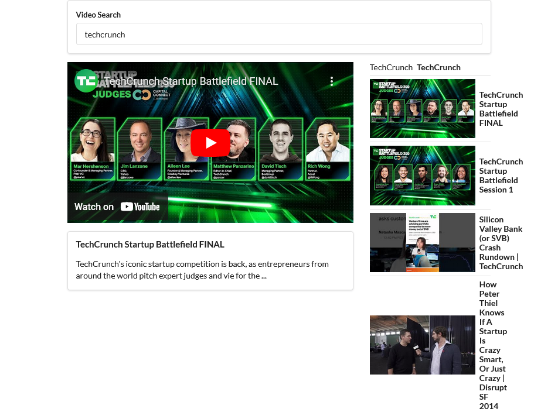

<h3 align="center">
  React Application with Semantic-ui | Youtube-api-v3 
</h3>

<p align="center">
  <a href="#rocket-about-the-project">About the project</a>&nbsp;&nbsp;&nbsp;|&nbsp;&nbsp;&nbsp;
  <a href="#runner-installation">Installation</a>&nbsp;&nbsp;&nbsp;|&nbsp;&nbsp;&nbsp;
  <a href="#hammer-deploy">Test</a>&nbsp;&nbsp;&nbsp;|&nbsp;&nbsp;&nbsp;
  <a href="http://localhost:3000/" target="_blank" > Build</a>&nbsp;&nbsp;&nbsp;
</p>

<br>

<table>
      <tr>
            <td colspan="2">
                  <br />
                  <div>
                        💬&nbsp; 
                        💼&nbsp; <code>Javascript</code>, <code>React</code> <code>Youtube-api-v3</code>, <code>Semantic-ui</code>, <code>Axios</code>
                  </div>
                  <br />
            </td>
      </tr>
</table>

<p align="center">
  </p>
<br>

## :rocket: About the project

<table>
      <tr>
            <td colspan="2">
                  <br />
                  <div>
                        📱&nbsp; <code>The goal of this project was to demonstrate 📮 how to get feedback from user, fetch data from API or server then show lists of searched videos(youtube-like) content 📝
</code>
                  </div>
                  <br />
            </td>
      </tr>
</table>

# :construction_worker: Installation

```
  // 1 - Git Clone

  // 2 - Installing the dependencies
  npm install

  // 3 - Run the application in the development mode
  npm start

```

### `npm test`

Launches the test runner in the interactive watch mode.\
See the section about [running tests](https://facebook.github.io/create-react-app/docs/running-tests) for more information.

### `npm run build`

Builds the app for production to the `build` folder.\
It correctly bundles React in production mode and optimizes the build for the best performance.

The build is minified and the filenames include the hashes.\
Your app is ready to be deployed!

See the section about [deployment](https://facebook.github.io/create-react-app/docs/deployment) for more information.

### Deployment

This section has moved here: [https://facebook.github.io/create-react-app/docs/deployment](https://facebook.github.io/create-react-app/docs/deployment)

### `npm run build` fails to minify

This section has moved here: [https://facebook.github.io/create-react-app/docs/troubleshooting#npm-run-build-fails-to-minify](https://facebook.github.io/create-react-app/docs/troubleshooting#npm-run-build-fails-to-minify)
